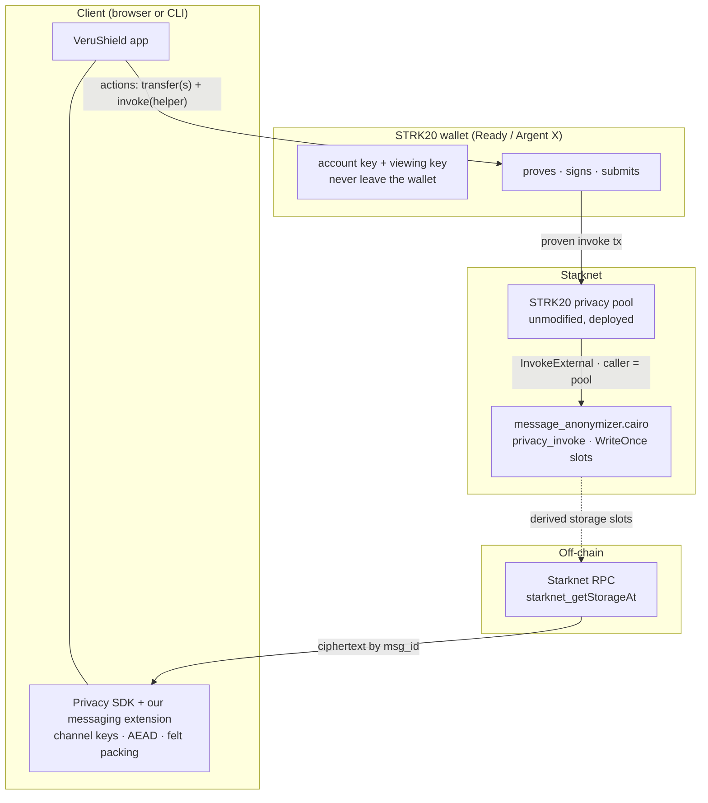

# VeruShield Connect

**Encrypted messaging and private payments, where the blockchain is the mailbox.**
No servers, no relayer, no metadata trail. Two people exchange messages and money by
writing ciphertext into the [STRK20 privacy pool](https://strk20.starknet.io/) on
Starknet and reading it back over any public RPC. The clients never talk to each other,
or to us.

> Built on Starknet's live STRK20 privacy pool. The helper contract is deployed on
> **mainnet** and **Sepolia**, both pinned to the real pool. See [Deployments](#deployments).

---

## What it does

- **💬 Private messaging.** 1-to-1 and group chat. Message content, the recipient, and the
  amount of any payment are hidden from everyone except the two parties (and a lawful
  auditor — see [threat model](docs/Milestone/02-threat-model.md)).
- **💸 Money in the chat.** Pay with an encrypted memo in one transaction, request a payment,
  split or tip a group, and match receipts against your own pool notes.
  [Details](docs/Milestone/19-payments-in-chat.md).
- **📦 Outbox batching.** Many messages, one proof, one fee.
- **🔑 Keys are the only backup.** Full history rebuilds from chain state alone.
- **👛 Wallet-native.** The app connects through a STRK20 wallet (Ready / Argent X) using the
  STRK20 wallet API. The wallet holds the account key and the viewing key, proves, and signs.
  Nothing is ever pasted into the app. [Details](docs/Milestone/20-wallet-mode.md).
- **🌐 Web app + CLI.**

## The idea in one paragraph

Two STRK20 participants share a **channel key**, derived by ECDH on the STARK curve the first
time either pays the other. We reuse that key to address message storage slots the same way
the pool addresses note slots: `msg_id = h(MSG_ID_TAG, channel_key, index)` — dense,
sequential, write-once. A message is an `InvokeExternal` action added to a pool transaction,
which makes the pool call our `message_anonymizer` helper, so the helper's on-chain caller is
the pool, not the author. The recipient finds messages by walking derived storage slots over
plain RPC and decrypting locally. There is **no relayer to build, no membership circuit to
write, no verifier to deploy, and no indexer required.**

## What is private, and what is not

This is the honest claim, and it is stated the same way in the [threat
model](docs/Milestone/02-threat-model.md). The design is **public sender, private recipient**
([Arch 1](docs/Milestone/16-arch1-plan.md)):

| Element | Visible on-chain? |
| --- | --- |
| Who paid / who sent (the submitting account) | **Yes — by design.** The payer submits their own transaction. |
| Who was paid (recipient) | No — except the *first* contact, which names them once in calldata. |
| Amount | No — packed in an encrypted note. |
| Message content | No — sealed with ChaCha20-Poly1305 under a per-message key. |
| That a pool transaction happened, its size bucket, its timestamp | Yes. |

Sender anonymity is a deliberate non-goal for v1. It bought nothing the pool did not already
give, and cost a paymaster dependency. The route back to it is documented in
[08-submission.md](docs/Milestone/08-submission.md).

## Architecture

Two components are ours: the **Cairo helper contract** and the **TypeScript SDK extension**.
Everything else is deployed by others or is plain infrastructure.



**Send:** the app derives the channel key, encrypts and pads the body, and hands the wallet an
action batch — the transfer actions if value moves, plus one `InvokeExternal` on the helper
for the memo. The wallet proves it, signs, and submits from its own account. The pool verifies
the proof in-protocol, then calls the helper, which asserts `caller == pool` and writes each
payload to its derived slot.

**Receive:** for each known channel, read `msg_id = h(MSG_ID_TAG, channel_key, index)` for
`index = 0, 1, 2, …` over RPC until the first empty slot, and decrypt locally.

Diagrams: [system architecture](docs/system-architecture.md) and
[sequence diagrams](docs/sequence-diagrams.md). Full walkthrough:
[03-architecture.md](docs/Milestone/03-architecture.md).

## Connecting — wallet mode

The app connects through a **STRK20 wallet** (Ready / Argent X) over the STRK20 wallet API
([SNIP-36 methods](docs/Milestone/20-wallet-mode.md)). This is the connection mode the product
ships:

- The wallet holds the account key **and** the viewing key. Neither is ever entered into, or
  seen by, the app.
- Every send is a single action batch — the transfer actions plus one `invoke` on the helper
  for the memo — that the wallet **proves, signs, and submits** behind its own prompt.
- Balances shown in the app come from `wallet_strk20Balances`; the app needs no proving-service
  URL and no key management of its own.

Funds enter the pool by shielding inside the wallet (the wallet handles deposit screening),
then reach a counterparty as an unscreened private transfer. See
[20-wallet-mode.md](docs/Milestone/20-wallet-mode.md) for the exact API calls and the one
trade-off (a message-only send spends 1 wei of a shielded carrier note, because a wallet
proves with the stock SDK).

> The codebase also contains internal `demo`, `direct`, and `pool` backends used during
> development. They are not part of the shipped connection flow and are not required to run
> the product.

## Repository layout

| Path | What |
| --- | --- |
| [contracts/](contracts/) | `message_anonymizer.cairo` — the helper (Cairo, WriteOnce storage). |
| [sdk/](sdk/) | TypeScript SDK: channel derivations, AEAD, felt packing, payment memos, outbox. |
| [apps/web/](apps/web/) | React web client (Vite, Tailwind v4). Wallet-native (STRK20 wallet API). |
| [apps/cli/](apps/cli/) | CLI client. |
| [docs/Milestone/](docs/Milestone/) | Full design and implementation docs — [start here](docs/README.md). |
| [scripts/](scripts/) | Devnet seeding, SDK patch, Sepolia register/deposit, pool readers. |
| [vectors/](vectors/), [spikes/](spikes/) | Cairo-reference test vectors and M0 verification spikes. |

## Run it

```bash
pnpm install
pnpm -r build
pnpm run web            # http://localhost:5173
```

Then connect a STRK20 wallet (Ready / Argent X) on the network the app is pointed at, and it
is ready to message and pay. The wallet does the proving and signing; the app holds no keys.
The full build recipe and the CLI are documented in
[apps/web/README.md](apps/web/README.md) and [apps/cli/README.md](apps/cli/README.md).

```bash
pnpm -r test            # unit + logic tests (85+ green)
```

## Deployments

Full records, class hashes, and fees: [DEPLOYMENTS.md](DEPLOYMENTS.md).

| Network | Helper (`message_anonymizer`) | Pinned pool |
| --- | --- | --- |
| **Mainnet** | [`0x030a2a…b3a6`](https://voyager.online/contract/0x030a2a39c47adba579c8fd07e7d9adbf5fe8f36b97da0b6ead884cae3a8bb3a6) | `0x040337b1…e812a` (real STRK20 mainnet pool) |
| **Sepolia** | [`0x016f77…e0b6`](https://sepolia.voyager.online/contract/0x016f77a566ed28f2945e315f2de971b8f3e83a03b93340e8927a311277f6e0b6) | `0x254a6b29…e0d91` (real STRK20 Sepolia pool) |

The helper's constructor pins the pool address, and only the pool can call `privacy_invoke`
(`CALLER_NOT_POOL` otherwise); `pool()` was verified to echo the intended address after each
deploy. A real message on Sepolia:
[`0x2224a3…f395`](https://sepolia.voyager.online/tx/0x2224a360cd80384332d0ead9d7f801e1d4142f40fd98e0814fb7a5302ff395).
Cost is about $0.006 per message.

## Documentation

The design is documented in depth under [docs/Milestone/](docs/README.md), from
overview and threat model through contracts, SDK, discovery, and the milestone plan. The most
useful entry points:

- [01-overview.md](docs/Milestone/01-overview.md) — the gap this fills over stock STRK20.
- [02-threat-model.md](docs/Milestone/02-threat-model.md) — adversaries, leaks, the auditor key.
- [03-architecture.md](docs/Milestone/03-architecture.md) — components and end-to-end flow.
- [16-arch1-plan.md](docs/Milestone/16-arch1-plan.md) — public sender, private recipient.
- [19-payments-in-chat.md](docs/Milestone/19-payments-in-chat.md) — pay, request, split, receipts.
- [20-wallet-mode.md](docs/Milestone/20-wallet-mode.md) — the STRK20 wallet API path.

## Tech

Cairo (WriteOnce storage) · TypeScript SDK (ChaCha20-Poly1305 + Poseidon over `@scure`/`@noble`) ·
React + Vite + Tailwind v4 · starknet.js 10.5 · self-hostable Stwo proving service.

## Team & license

Built by **Venture23 Inc.** MIT licensed — see [LICENSE.md](LICENSE.md).
