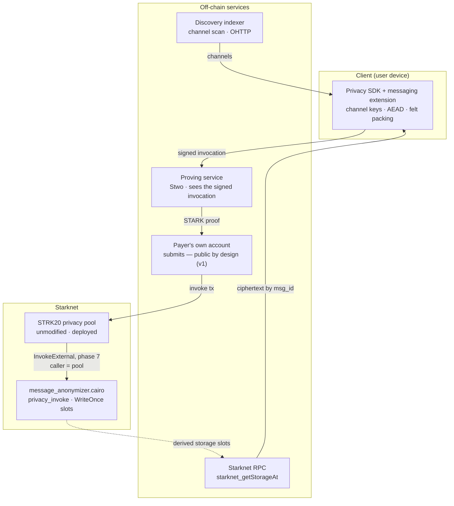

# 03 — Architecture

## Component map

**Two components are ours**: the helper contract and the SDK extension. Everything else is
deployed, operated by others, or plain infrastructure.

## End-to-end flow — sending

1. **Derive.** The SDK obtains the `channel_key` for the sender→recipient lane — already
   computed by the Privacy SDK, or established by an `OpenChannel` action if this is first
   contact.
2. **Encrypt.** Pad the body to a size bucket, seal with ChaCha20-Poly1305 under
   `key_i = h(MSG_KEY_TAG, channel_key, index)`, pack into `felt252` at 31 bytes per felt.
3. **Build actions.** Append an `InvokeExternal` action (phase 7) targeting
   `message_anonymizer`, carrying one or more encrypted messages as calldata. If value also
   moves, the `UseNote` / `CreateEncNote` actions sit in the same batch — one atomic
   transaction.
4. **Prove.** The signed invocation goes to a **remote proving service**, which executes it in
   a virtual Starknet environment and returns a STARK proof. **This takes roughly 29 s on a
   12-core / 46 GiB machine** and is the dominant latency in the system. Note the service sees
   the witness — self-host for sensitive deployments. See [08-submission.md](08-submission.md#proving-latency-is-the-ux).
5. **Submit.** The payer submits from their own account — public by design in v1
   ([16](16-arch1-plan.md)); the recipient and the amount are what the proof hides. A
   paymaster relay remains the documented route to sender anonymity ([08](08-submission.md)).
6. **Settle.** Starknet verifies the proof in-protocol; the pool checks proof facts and anchor
   recency, then calls `privacy_invoke`. The helper asserts `caller == pool`, writes each
   payload to its derived WriteOnce slot, and returns an `OpenNoteDeposit` span — empty for a
   pure message.

## End-to-end flow — receiving

1. **Walk.** For each known channel, compute `msg_id = h(MSG_ID_TAG, channel_key, index)` for
   `index = 0, 1, 2, …` and read each slot with `starknet_getStorageAt` until the first empty
   one. Dense indices are what make this terminate.
2. **Decrypt.** Locally, with the channel key. Nothing off-device ever holds key material.
3. **First contact.** Handled entirely by STRK20's existing channel scan — the recipient
   trial-decrypts channel records to discover new channels, exactly as it does for payments.
   We add nothing here.

**Message payloads need no indexer** — the walk is plain `starknet_getStorageAt`. **Channel
discovery currently does**, because the SDK's RPC-backed provider is not yet exported. See
[07-discovery.md](07-discovery.md).

## Payment memo

Not a multicall. A memo is an `InvokeExternal` action sitting in the same action batch as the
transfer's `UseNote` and `CreateEncNote` actions, inside one proven pool transaction. It is
atomic by construction, and it inherits the transfer's anonymity rather than degrading it —
a strict improvement over the multicall approach the previous revision described.

The constraint: **at most one `InvokeExternal` per transaction.** A memo and a swap cannot
share a transaction. Batch multiple *messages* into that single invoke instead — the helper's
calldata is ours to design.

## Design principles

**Inherit, don't reimplement.** Every primitive STRK20 supplies is one we do not build, and
one whose anonymity set we join rather than fragment.

**The helper holds no keys and makes no decisions.** It asserts its caller, writes bytes to
derived slots, and returns. All cryptography is off-chain and auditable in TypeScript.

**Discovery must work with nothing but an RPC URL.** Any service we add must be an
optimisation the user can decline.

**Failures degrade to latency, never to disclosure.** In v1 the payer already submits
directly, so there is no paymaster to lose; a proving-service outage means the payment waits,
it does not mean anything about the recipient or the amount becomes visible. If a paymaster
is reintroduced, falling back to direct submission must be an explicit choice, as before.
