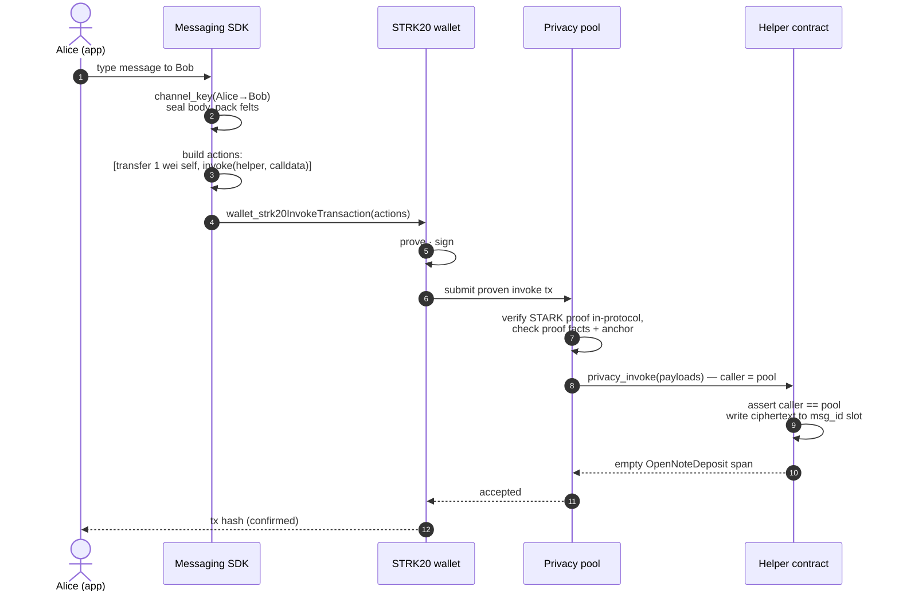
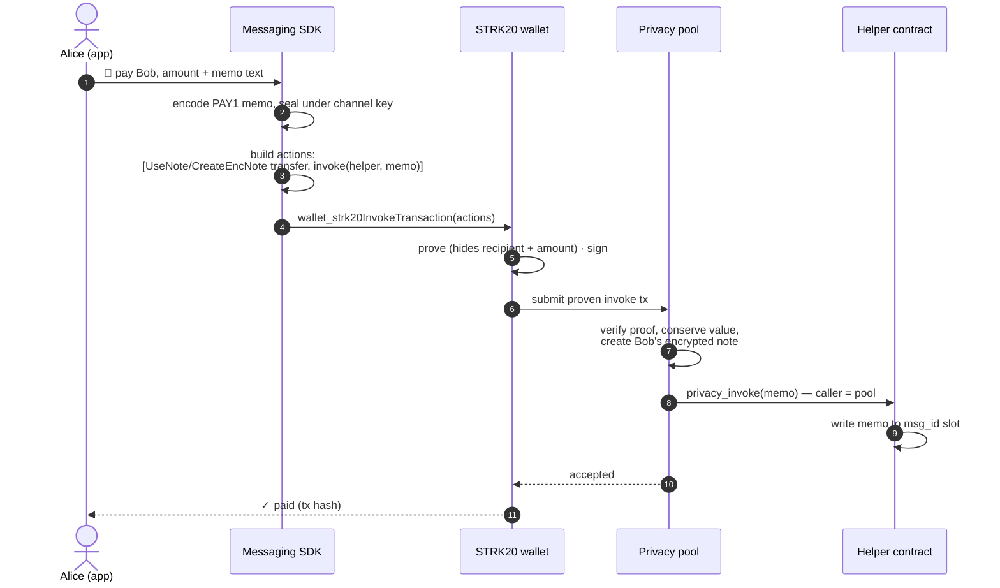

# 23 — Sequence diagrams

Step-by-step flows for the three things the app does: send a message, pay with a memo, and
receive. All are drawn for **wallet mode** ([20-wallet-mode.md](Milestone/20-wallet-mode.md)), where the
STRK20 wallet holds the keys and does the proving, signing, and submission.

## 1 — Send a message

A message-only send. It carries a 1 wei transfer to self as the pool's WriteOnce replay
protection (a wallet proves with the stock SDK, which refuses a zero-amount carrier note).



The first message to a new peer also carries the channel `setup`, which names the recipient in
clear calldata once — see [02-threat-model.md](Milestone/02-threat-model.md).

## 2 — Pay with a memo

A private payment and its encrypted memo in one transaction. The recipient and amount are
hidden; the paying account is public.



Value and memo are one atomic action batch, so the memo inherits the transfer's anonymity
rather than degrading it. Formats for pay / request / split / receipts are in
[19-payments-in-chat.md](Milestone/19-payments-in-chat.md).

## 3 — Receive and discover

No push, no server. The recipient reads derived storage slots over plain RPC and decrypts
locally.

```mermaid
sequenceDiagram
  autonumber
  actor B as Bob (app)
  participant SDK as Messaging SDK
  participant W as STRK20 wallet
  participant RPC as Starknet RPC
  participant P as Privacy pool

  B->>W: wallet_strk20Balances() (in-pool balance)
  B->>SDK: ↻ discover
  SDK->>P: scan channel records (trial-decrypt with viewing key)
  P-->>SDK: incoming channel(s) from senders
  loop each channel, index = 0,1,2,…
    SDK->>SDK: msg_id = h(MSG_ID_TAG, channel_key, index)
    SDK->>RPC: starknet_getStorageAt(helper, msg_id)
    RPC-->>SDK: ciphertext (or empty → stop)
    SDK->>SDK: decrypt locally; if PAY1, match against own notes
  end
  SDK-->>B: thread with messages and payments
```

Dense, sequential indices are what make the walk terminate at the first empty slot. Because
this is a plain storage read, message discovery needs nothing but an RPC URL; see
[07-discovery.md](Milestone/07-discovery.md).
