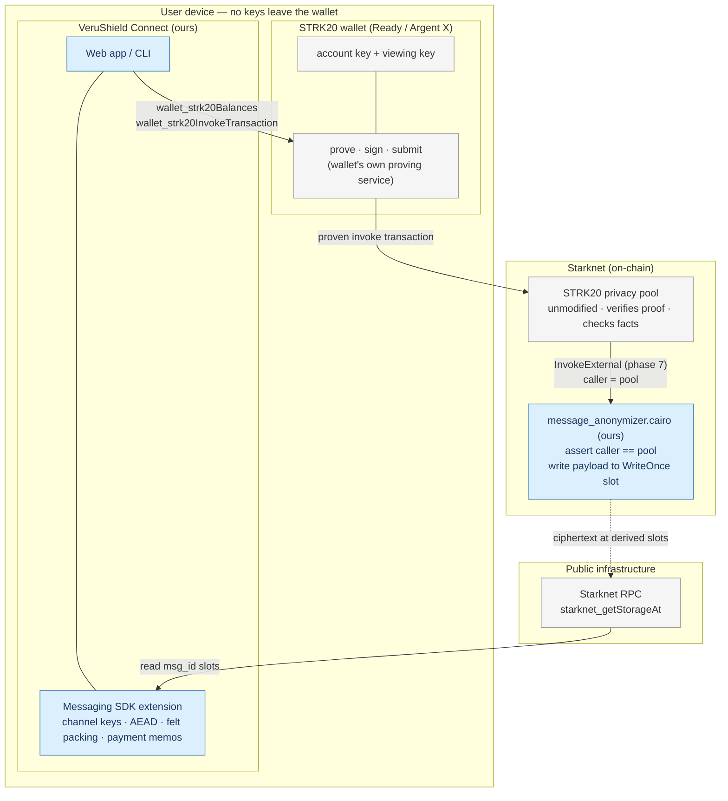

# 22 — System architecture

The system in one picture, with trust boundaries drawn explicitly. Two things are ours: the
**Cairo helper contract** and the **TypeScript SDK extension**. The wallet, the pool, the
proving service, and the RPC are operated by others. The product connects through a **STRK20
wallet** ([20-wallet-mode.md](Milestone/20-wallet-mode.md)), which holds every key and does the proving
and signing.

## Components and trust boundaries

Blue nodes are the two components this project builds. Everything else is inherited.

## What each part does

| Part | Owner | Responsibility |
| --- | --- | --- |
| **Web app / CLI** | ours | UI, contact list, outbox batching. Assembles the action batch; holds no keys. |
| **Messaging SDK extension** | ours | Derives `msg_id`/`msg_key` from the channel key, seals bodies with ChaCha20-Poly1305, packs felts, encodes payment memos, walks slots on receive. |
| **STRK20 wallet** | third party | Custodies the account key and viewing key. Proves the invocation, signs, and submits. The single visible actor on-chain. |
| **STRK20 privacy pool** | Starknet | Verifies the STARK proof in-protocol, checks proof facts and anchor recency, then calls the helper's `privacy_invoke`. Unmodified. |
| **message_anonymizer.cairo** | ours | Asserts `caller == pool`, writes each payload to its derived WriteOnce slot, returns an (empty, for pure messages) `OpenNoteDeposit` span. |
| **Starknet RPC** | public | Serves `starknet_getStorageAt` for the receive-side slot walk. No indexer required. |

## Trust and privacy boundaries

- **Keys never leave the wallet.** The app cannot see the account key or the viewing key; it
  can only ask the wallet to act. This is the core property wallet mode buys.
- **The helper's caller is the pool, not the author.** Because a message rides an
  `InvokeExternal` action inside a proven pool transaction, the on-chain caller of the helper
  is always the pool. The author is the wallet's submitting account — public by design.
- **The proving service sees the witness.** In wallet mode that service belongs to the wallet,
  not to us. The recipient and amount are hidden from the chain, not from whoever proves.
- **Discovery needs only an RPC URL.** The receive path is a plain storage read; any service
  the app adds is an optimisation the user can decline.

See [02-threat-model.md](Milestone/02-threat-model.md) for the full adversary analysis and
[03-architecture.md](Milestone/03-architecture.md) for the prose walkthrough.
